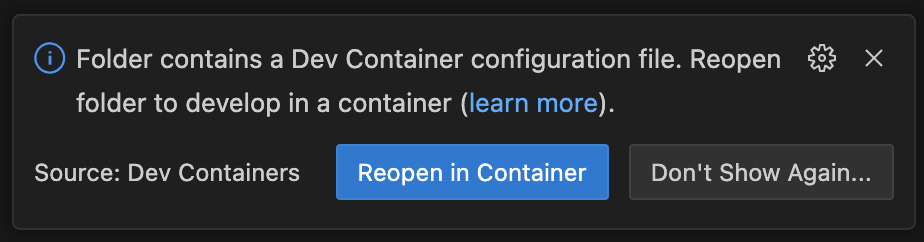
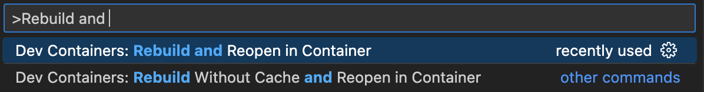

# MSc in Data Engineering & AI (Self-Designed)
A 12-month program focused on building real-world expertise in data engineering and machine learning using GCP, Python, and modern tooling.

## Local Set-Up
The local environment uses a VS Code dev container setup.

### Prerequisites
- VS Code is the code editor required to spin up the local devcontainer
- Docker is required for containerisation
- Google Cloud SDK should be set up with default credentials created at `~/.config/gcloud/application_default_credentials.json` by following these steps:
    - Install the gcloud CLI:
        - MacOs: run `brew install --cask google-cloud-sdk`
        - Windows: Download from here: https://cloud.google.com/sdk/docs/install
    - Run `gcloud init` in your command line. This will:
        - Log you into your Google account
        - Set a default project
        - Configure your CLI environment
    - Authenticate with Application Default Credentials by running: `gcloud auth application-default login`

### Spinning up local dev environment

There are two ways you can spin up the Docker VS Code dev container, both rely on the Docker daemon running. Open the repository in VS Code and you should be prompted to `Reopen in Container`:

If the prompt disappears, simply press Command+Shft+P on a Mac or Ctrl+Shft+P on Windows and search Rebuild and Reopen in Container:

### Initialising the Terraform Infrastructure in GCP

Terraform requires a remote backend to store its state files. In GCP, this is typically a Cloud Storage bucket. While it's common to create this bucket manually or manage it in a centralised project that provisions state buckets for multiple environments, this setup opts for a more modular approach.

A dedicated `infra-init` folder is used to initialise the Terraform backend. This folder is isolated from the main infrastructure code and is responsible solely for provisioning the GCS bucket and any required service accounts or permissions needed to bootstrap the rest of the Terraform configuration.

Initialising the GCP projects terraform infrastructure is automated by the following Make commands:
- `make tf-init-infra-init` will initialise terraform
- `make tf-plan-infra-init` will present a plan for the terraform apply, there will be ten objects to deploy
- `make tf-apply-infra-init` will prompt for a response, type `yes` and it will deploy the ten objects
- Once the bucket is created the state file needs to be migrated to the GCS bucket so the infrastructure config is entirely stored in the cloud. The `backend.tf` which usually exists in a terraform project doesn't initially exist to default the backend to local. Run `make create-backend-infra-init` to create it.
- `make migrate-state-infra-init` will prompt for a response, type `yes` to migrate the state file to GCS

### GitHub Actions Set-up

The running of the above terraform deployment will result in the output of a file located at `infra-init/sa-key-base64.txt`. This file contains a base64 encoded service account key, copy the contents of this file. In the GitHub repo, navigate to `Settings` > `Secrets and variables` > `Actions` and add a `New repository secret` called `GCP_SA_KEY` and paste the encoded security key you copied. Be sure to delete the `infra-init/sa-key-base64.txt` file.
