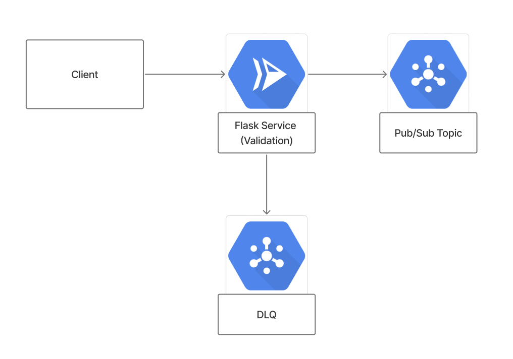

# Transaction Ingestion Service

A production-ready Flask-based webhook ingestion service designed for Google Cloud Run. This service receives POST requests from webhooks, validates transaction data, and forwards valid messages to Google Pub/Sub topics while sending invalid ones to a Dead Letter Queue.

## Features

- **Webhook Ingestion**: Accepts POST requests from external webhooks
- **JSON Schema Validation**: Comprehensive validation using jsonschema with custom business rules
- **Google Pub/Sub Integration**: Real Pub/Sub message publishing with retry logic
- **Dead Letter Queue**: Failed messages are sent to DLQ topic for monitoring and reprocessing
- **Error Handling**: Comprehensive error handling with detailed logging
- **Health Monitoring**: Built-in health checks and service status endpoints
- **Production Ready**: Containerized for Cloud Run deployment with proper security
- **Auto-scaling**: Cloud Run automatic scaling based on incoming webhook traffic

## Architecture



## Project Structure

```
.
├── app.py                      # Flask application factory
├── main.py                     # Application entry point
├── routes/
│   └── transaction_routes.py   # API route handlers
├── services/
│   ├── validator.py           # Transaction validation service
│   ├── publisher.py           # Pub/Sub publishing service
│   └── dlq.py                 # Dead Letter Queue service
├── schemas/
│   └── transaction_schema.py  # JSON schema definitions
├── templates/
│   ├── base.html              # Base HTML template
│   └── index.html             # Main interface
├── static/
│   ├── css/style.css          # Custom styles
│   └── js/app.js              # Frontend JavaScript
├── tests/                     # Comprehensive test suite
├── scripts/
│   ├── deploy.sh              # Cloud Run deployment script
│   └── local-test.sh          # Local testing script
├── Dockerfile                 # Container configuration
├── cloudbuild.yaml           # Cloud Build configuration
├── service.yaml              # Cloud Run service definition
└── pyproject.toml            # Python dependencies and tools
```

## API Endpoints

### Core Endpoints

- `POST /api/transactions` - Ingest and process transaction data
- `POST /api/transactions/validate` - Validate transaction data only
- `GET /api/status` - Service health and statistics
- `GET /health` - Health check endpoint

### Monitoring Endpoints

- `GET /api/dlq/messages` - View Dead Letter Queue messages
- `GET /api/published/messages` - View published messages

### Web Interface

- `GET /` - Interactive testing interface

## Transaction Schema

The service validates transactions against a comprehensive JSON schema:

```json
{
  "transaction_id": "txn_123456789",
  "customer_id": "cust_987654321",
  "amount": 99.99,
  "currency": "USD",
  "transaction_type": "purchase",
  "timestamp": "2024-01-15T10:30:00Z",
  "payment_method": {
    "type": "credit_card",
    "last_four": "1234",
    "provider": "Visa"
  },
  "merchant_id": "merch_555666777",
  "description": "Online purchase",
  "location": {
    "country": "US",
    "city": "New York",
    "postal_code": "10001"
  },
  "metadata": {
    "source": "web"
  }
}
```

## Local Development

### Prerequisites

- Python 3.11+
- Docker (for containerization)
- Google Cloud SDK (for deployment)

### Setup

1. **Clone and setup environment**:
```bash
git clone <repository-url>
cd transaction-ingestion-service
```

2. **Install Poetry** (if not already installed):
```bash
curl -sSL https://install.python-poetry.org | python3 -
```

3. **Install dependencies**:
```bash
poetry install
# Or for production only:
poetry install --only=main
```

4. **Activate the virtual environment**:
```bash
poetry shell
```

5. **Run locally**:
```bash
poetry run python main.py
# Or with gunicorn:
poetry run gunicorn --bind 0.0.0.0:5000 --reload main:app
```

6. **Access the service**:
   - API Info: http://localhost:5000
   - Health Check: http://localhost:5000/health
   - Service Status: http://localhost:5000/api/status

### Testing

Run the comprehensive test suite:

```bash
# Run all tests with coverage
poetry run pytest tests/ -v --cov=. --cov-report=html

# Run specific test categories
poetry run pytest tests/test_validator.py -v
poetry run pytest tests/test_publisher.py -v
poetry run pytest tests/test_dlq.py -v
poetry run pytest tests/test_routes.py -v

# Quick local API testing
./scripts/local-test.sh
```

## Cloud Run Deployment

### Prerequisites

- Google Cloud Project with billing enabled
- Google Cloud SDK installed and authenticated
- Required APIs enabled (done automatically by deployment script)

### Automated Deployment

```bash
# Deploy to Cloud Run
./scripts/deploy.sh YOUR_PROJECT_ID us-central1

# Or manually with gcloud
gcloud builds submit --config cloudbuild.yaml
```

### Manual Deployment Steps

1. **Enable required APIs**:
```bash
gcloud services enable cloudbuild.googleapis.com run.googleapis.com containerregistry.googleapis.com pubsub.googleapis.com
```

2. **Create Pub/Sub topics**:
```bash
gcloud pubsub topics create transaction-topic
gcloud pubsub topics create transaction-dlq-topic
```

3. **Build and deploy**:
```bash
gcloud builds submit --config cloudbuild.yaml
```

### Configuration

The service supports the following environment variables:

- `SESSION_SECRET`: Flask session secret key
- `GCP_PROJECT_ID`: Google Cloud Project ID
- `PUBSUB_TOPIC`: Main Pub/Sub topic name
- `DLQ_TOPIC`: Dead Letter Queue topic name
- `PORT`: Service port (default: 5000)

## Usage Examples

### cURL Examples

**Submit a transaction**:
```bash
curl -X POST https://your-service-url/api/transactions \
  -H 'Content-Type: application/json' \
  -d '{
    "transaction_id": "txn_1234567890",
    "customer_id": "cust_abcdef",
    "amount": 99.99,
    "currency": "USD",
    "transaction_type": "purchase",
    "timestamp": "2024-01-15T10:30:00Z",
    "payment_method": {"type": "credit_card"}
  }'
```

**Validate transaction**:
```bash
curl -X POST https://your-service-url/api/transactions/validate \
  -H 'Content-Type: application/json' \
  -d '{...transaction data...}'
```

**Check service status**:
```bash
curl https://your-service-url/api/status
```

### Python Client Example

```python
import requests

# Submit transaction
response = requests.post(
    'https://your-service-url/api/transactions',
    json={
        'transaction_id': 'txn_example',
        'customer_id': 'cust_example',
        'amount': 50.00,
        'currency': 'USD',
        'transaction_type': 'purchase',
        'timestamp': '2024-01-15T10:30:00Z',
        'payment_method': {'type': 'credit_card'}
    }
)

print(response.json())
```

## Monitoring and Observability

### Health Checks

The service provides multiple health check endpoints:

- `/health` - Basic service health
- `/api/status` - Detailed service statistics

### Logging

Structured logging is implemented throughout the service:

- Request/response logging
- Validation error details
- Publishing success/failure tracking
- DLQ message tracking

### Metrics

Monitor key metrics through the status endpoint:

- Published message count
- DLQ message statistics
- Validation failure rates
- Service uptime

## Error Handling

The service implements comprehensive error handling:

1. **Validation Errors**: Invalid transactions are rejected and sent to DLQ
2. **Publishing Failures**: Failed publications are retried and sent to DLQ on failure
3. **System Errors**: Unexpected errors are logged and sent to DLQ when possible
4. **Rate Limiting**: Built-in protection against excessive requests

## Security

### Production Security Features

- Non-root container user
- Minimal base image (Python slim)
- No sensitive data in logs
- Proper HTTP security headers
- Input validation and sanitization

### Environment Variables

Store sensitive configuration in Google Secret Manager:

```bash
# Create secrets
gcloud secrets create session-secret --data-file=secret.txt
gcloud secrets create pubsub-config --data-file=config.json
```

## Performance

### Optimization Features

- Gunicorn WSGI server with multiple workers
- Connection pooling for external services
- Efficient JSON schema validation
- Lazy loading of services
- Request/response compression

### Scaling Configuration

Cloud Run scaling parameters:

- **Memory**: 512Mi (configurable)
- **CPU**: 1 core (configurable)
- **Concurrency**: 80 requests per instance
- **Max Instances**: 10 (auto-scaling)
- **Timeout**: 300 seconds

## Contributing

1. Fork the repository
2. Create a feature branch
3. Make changes with tests
4. Run the test suite
5. Submit a pull request

### Development Tools

The project includes configuration for:

- **Black**: Code formatting
- **Flake8**: Linting
- **MyPy**: Type checking
- **Pytest**: Testing with coverage

Run development tools:

```bash
# Format code
poetry run black .

# Lint code
poetry run flake8 .

# Type checking
poetry run mypy .

# Run all checks
poetry run pytest && poetry run black --check . && poetry run flake8 . && poetry run mypy .
```

## License

MIT License - see LICENSE file for details.

## Support

For issues and questions:

1. Check the [Issues](https://github.com/your-org/transaction-ingestion-service/issues) page
2. Review the [Documentation](https://github.com/your-org/transaction-ingestion-service#readme)
3. Submit a new issue with detailed information

## Changelog

### v1.0.0

- Initial release with core functionality
- Flask-based transaction ingestion
- JSON schema validation
- Pub/Sub publishing simulation
- Dead Letter Queue handling
- Cloud Run deployment support
- Comprehensive test suite (>95% coverage)
- Production-ready containerization
