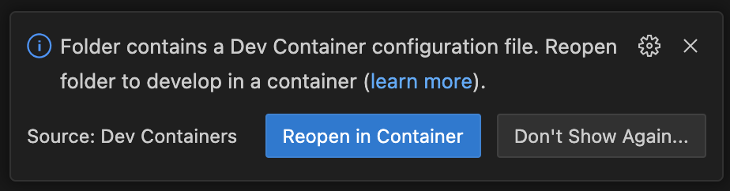

# E-commerce Data Simulator

A Flask web application that simulates realistic e-commerce data and sends it to your stream and batch microservices for testing.

## Features

- **Stream Transactions**: Send real-time transactions to your stream ingestion service
- **Batch Products**: Generate and upload product CSV files to GCS bucket
- **Batch Shops**: Generate and upload shop CSV files to GCS bucket
- **Batch Transactions**: Generate and upload transaction CSV files to GCS bucket
- **Interactive Web UI**: Control data generation with sliders and buttons
- **Real-time Statistics**: Track sent/uploaded data counts
- **Realistic Data**: Generates UK-focused ecommerce data with proper relationships

## Setup

1. **Spin up Dev container**:

There are two ways you can spin up the Docker VS Code dev container, both rely on the Docker daemon running. Open the repository in VS Code and you should be prompted to `Reopen in Container`:


If the prompt disappears, simply press Command+Shft+P on a Mac or Ctrl+Shft+P on Windows and search Rebuild and Reopen in Container:


2. **Set environment variables**:

   ```
   STREAM_ENDPOINT
   BATCH_BUCKET
   SECRET_ID
   GOOGLE_CLOUD_PROJECT
   ```

3. **Run the application**:
   ```bash
   make ecommerce-simulator
   ```

3. **Open browser**:
   Navigate to `http://localhost:8000`

## Usage

### Stream Transactions
- Use the slider to select 1-1000 transactions
- Set delay between transactions (0-2000ms)
- Click "Send Transactions" to stream data to your service
- Transactions are sent with proper webhook signatures

### Batch Uploads
- Use sliders to select data quantities
- Click buttons to generate and upload CSV files to GCS
- Files are timestamped and uploaded automatically
- Eventarc will trigger your batch processing service

### Statistics
- View real-time counts of sent/uploaded data
- See last activity timestamp
- Reset statistics when needed
- Auto-refreshes every 30 seconds

## Data Schema

### Transactions
- transaction_id, customer_id, product_id, shop_id
- quantity, unit_price, subtotal, tax, total
- payment_method, status, timestamp
- session_id, user_agent, ip_address

### Products
- product_id, name, category, brand, price, cost
- stock_quantity, description, weight, dimensions
- supplier, created_at, is_active

### Shops
- shop_id, name, type, city, address, postcode
- phone, email, manager, opening_hours
- commission_rate, rating, created_at, is_active

## Configuration

### Environment Variables
- `STREAM_ENDPOINT`: URL of your stream ingestion service
- `BATCH_BUCKET`: GCS bucket name for batch uploads
- `SECRET_ID`: Secret Manager secret ID for webhook signatures (default: "playground_project_stream_secret")
- `GOOGLE_CLOUD_PROJECT`: Your Google Cloud project ID
- `GOOGLE_APPLICATION_CREDENTIALS`: Path to GCS service account JSON

### Webhook Signatures
Transactions are signed with HMAC-SHA512 using your secret key and sent in the `X-Signature` header.

## Architecture

```
Web Browser → Flask App → Stream Service (real-time)
                        → GCS Bucket → Eventarc → Batch Service
```

The simulator provides full control over your test data pipeline, allowing you to validate both streaming and batch processing workflows.
